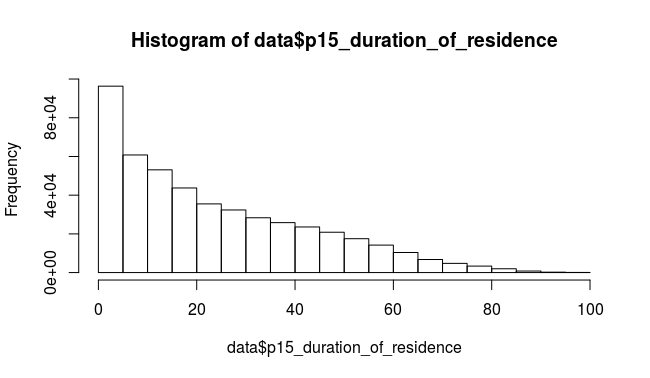
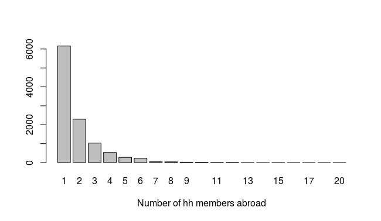

# Fieldwork Journal

## Tuesday 22.11.2016 - Arrival in Yangon

## Wednesday 23.11.2016 - Prep

Prepared for meeting, worked on census brief, dealt with jet lag. 

## Thursday 24.11.2016 - Meeting with MSR team
  
Met with Patrick Meza and Kay from MSR to discuss open questions re questionnaire, sampling and other issues. These are minuted below, whit the outstanding issues highlighted in bold, and listed at the end again for the attention of SH, GL and KH. 

### Survey timeline

MSR had provided us with a work plan and timeline in their EOI (page 6). As they had not heard anything to the contrary, they assumed we are sticking with it. That would have us receive the report 31. January 2017. 

Assuming this is a bit late, we discussed the possibility of speeding it up. Subject to their confirmation of enumerator availability, and our approval of the questionnaire, they may be able to do the following:

* Week of 28.11.-2.12. back translation of questionnaire complete, our approval granted;
* Week of 5.12.-9.12. finalization of the sampling frame, training of the enumerators and pilot of the questionnaire
* Week of 12.12. Data collection can commence and could be completed before New Year's
* This would then allow delivery of final data mid January.

This is to be confirmed by Patrik tomorrow. I was under the impression that this is the most that can be squeezed out of them, given that  Christmas holidays still have an effect on work schedules here, despite it being a Buddhist country. 

**Is this timeline acceptable?**

### Questionnaire

#### Village level questionnaire

At the village level the enumerators will collect the information about the village from the village person in charge. This will include the number of households, as well as the number of landless farmers, and the number of farmers. **Was that everything? **

#### Household level questionnaire

**Q4** Education levels. MSR provided their (local) categorization of education levels. [I think it was 1. not completed primary, 2. completed primary, .. unfinished college, finished college.] BUT they also had the category *"illiterate"*. Now this may be pedantic, but I don't think that should be in the same question, as it is not mutually exclusive with having had some education. So I asked them to i) yes, change to their categorization of education, and ii) but remove the illiterate option. 

The question is however if we **do want to ask an illiteracy question?**In the census for example, everyone is asked "can XX read and write in any language". 

**Q31** (has your land holding decreased) MSR suggest we add the options 4. confiscated by the government and 5. inheritance. 4 refers to the government confiscating land - usually with compensation - for rezoning, building etc. 5 in my understanding refers to what we already had as "gave away some land" - the point being that we would only count it as inheritance after you die (in which case you cannot answer our survey :) but they seem to call it inheritance even if you give it to your children while still alive. **Are we ok with adding confiscation, but not inheritance as a separate option?**

**Q36** (person-days of labour) This is a question that should be manageable by the enumerators, but will require very clear explanation during training. But MSR are confident it will be OK. 

**Q40, 43-46** (sources of knowledge, reasons for increase/decrease of yield and challenges individually/communally to farming). These are the four questions we wanted to get rankings from. We had a very long discussion about the wording and framing of these questions, in particular because of the danger that prompting would lead to recall bias. And on the other hand that non-prompting would lead to a preponderance of "other" answers, which would be difficult to code. 
MSR suggested instead that the question flow gets effectively split into two:

1. The options are listed to the respondent (in random order - this is simple with CAPI) and they are asked "whether it is a factor", making it a yes/no question

2. Then they are asked which one is the most important one, and which one the second most important one. (And for questions 45 and 46 also the third most important one).

That way they suggest we avoid the risk of recall bias, and get the ranking for the top options. **Is this OK for all four questions?**

**Q46** (challenges to community). Kay wanted to add the option "labour too expensive". Now I think that from an economist's point of view this is the same as "shortage of labour to hire", so adding it as an extra option unnecessarily increases the length of this question. Instead we can simply change this second option to "Shortage of labour to hire or labour too expensive" if we agree these are synonymous. **Can we add labour price to labour shortage option?** 

**Q53-54** (ownership of draught animals and machinery). The number "shared" is going to be minimal (LIFT data had single digits out of a sample of 4000), so probably not worth and can be safely removed. We can instead add a column for number "leased out". This seems reasonable. It would mean we have numbers owned, rented and rented out - which should pick up people that make a profit off renting out machinery. **Are we OK with replacing number shared with number leased?**

**Q53** We should add cows/oxen as an option. **Yes?**

**Q54** We added irrigation pump as an option (this is an option from the LIFT survey, and increases our water management coverage).

**Q59-60** (inability to purchase machinery). They suggest adding i) not enough money and ii) inability to perform maintenance. They also think our option "field characteristics" won't really work in these parts (this was a reference to low/high land rice fields in VN). **Which of these options should we leave?**

### Sampling frame

MSR will rewrite their Appendix D to take the following into account:

* Townships selected by PPS
* village tracts selected by simple random
* villages selected by PPS (very varying sizes!)
* 20 interviews per village selected by systematic random, based on village level info on landless/non landless farmers. 

Taking into account the 100/200 split of landless to non-landless, MSR also asked if we wouldn't want an additional  grouping of farmers into smallholders (under 5 acres) and large (over 5). I thought we would not, because:

* we are prescribing the landless numbers in order to undersample [e.g. LIFT has 50% landless (Table 54, page 36)], we want some, but not too many. 
* Of active farmers (the remaining 200 per region), we can expect to get a representative sample with the sampling scheme as it is. [e.g. LIFT has approx 30% large farms and 70% smallholders. ]
* That would make it approx 60 large, 140 small in each region, but could vary based on actual composition instead of because of the sampling frame. 
* a prior estimate of 30% is fine - no expectation of missing them, so unless that's too many, we don't have to do anything.

** Do we stick with 100/200 or add an additional e.g. 100/150/50 split to the household sampling?** 

They mentioned land-sharing arrangements as a third option that landless farmers may partake in, but thought it is probably a very small proportion, so maybe shouldn't worry about them?

There was some confusion about the "75 % actively involved in farming". MSRs understanding is that all of the 200 left are "actively involved in farming", whether through managing or directly - as long as they own farmland. Unless this meant that we want a maximum of 25% landowners who rent out all of their land and are therefore not actively involved in farming? But that number is way too high? ** Is the "actively involved in farming" distinction an additional sampling sub group we want to have, and if yes, how does that relate if yes to previous question (small/large)?**

Additionally we have the within household sampling, where they propose to go for the head of household or other responsible adult as the alternative. This is apparently a standard thing and will be written up in the new sampling frame. **Did we have any different wishes for respondents?**

Overall they usually get a 80 percent response rate!

### Next steps

Based on our meeting today MSR will provide a revised questionnaire, a revised sampling plan, and a revised timeline by tomorrow - Friday 25.11. Any responses from you I will pass on to them asap, and should be included in tomorrow's version. 

To recap the questions are:

1. Is the proposed new timeline acceptable?
2. Is there anything else to add to the village level info we need?
3. Are we happy with their education categorization and do we want a separate literacy question?
4. Are we OK with adding confiscation, but not inheritance as a separate option to Q31?
5. Are we OK with the new "unprompted ranking" system for Q 40, 43-46?
6. Can we expand the labour price to labour shortage option in Q46?
7. For draught animals and machinery, are we OK with replacing number shared with number leased?
8. Adding cows/oxen to Q53?
9. What options do we want for Q59 and Q60?

10.  Do we stick with 100/200 or add an additional e.g. 100/150/50 split to the household sampling? And do we have an even more additional split of the non-landless to take into account  farming activity?

## Friday 25.11.2016 No news

## Saturday 26.11.2016 - updates

Received responses from KH and SH on questions from Thu.

### Consolidated comments from KH and SH:

1. Is the proposed new timeline acceptable? 

> *SH: will have to be*

2. Is there anything else to add to the village level info we need?

> *KH: population count*

3. Are we happy with their education categorization and do we want a separate literacy question?

> *KH: follow their advice on education*

> *SH: follow their advice on illiterate, GH to confirm*

4. Are we OK with adding confiscation, but not inheritance as a separate option to Q31?

> *KH: Accept their advice on confiscation and inheritance.*

> *SH: Include inheritance*

5. Are we OK with the new "unprompted ranking" system for Q 40, 43-46?

> *KH,  SH: OK*

6. Can we expand the labour price to labour shortage option in Q46?

> *KH: Yes*

> *SH:  Add labour price*

7. For draught animals and machinery, are we OK with replacing number shared with number leased?

> *KH: Yes*

8. Adding cows/oxen to Q53?

> *KH:Yes*

9. What options do we want for Q59 and Q60?

> *SH: Leave all*

10.  Do we stick with 100/200 or add an additional e.g. 100/150/50 split to the household sampling? And do we have an even more additional split of the non-landless to take into account  farming activity?

> *KH: I think the 100/200 split and the 75% active farmers might refer to the same thing. We started with a suggestion of 100/200 for landless to farming - and then increased to 75%?  So we have to drop one of them. Check with GL*

## Sunday 27.11.2016 - updates

Traveled to Naypyitaw. 

Received response from Patrick and new version of questionnaire. 

### Comments on Kay's new version of questionnaire

*taking into account SH and KH comments from yesterday* 

Q2: Is it better for the age to be categorized - *NO, leave as single year*

Q4: These are not mutually exclusive options. Option a) should be "never attended school"!
(e.g. according to the census there are 4.3 million adults who never attended school, and 3.5 million who are illiterate. )
<!--`r 28720000*0.142+4313000*0.067`-->

Q15b: No, we wanted family and non-family split up, so:
* family and relatives
* friends and neighbours

Q15e: Where did this come from? We did not discuss this option, did we?

Q31: This question doesn't work anymore, how could a respondent answer c (confiscate) as the reason?

Confiscation has to be added as a new row in the table.

And option d) also cannot read "gave away", because that is the wording of the third row.

Q36: Yes, this is correct

Q40, 43:46. This is not what we discussed. We discussed the table Patrick showed, with the first column for Yes/No question, and then the question about which is the most important, and which the second (or third). 

Q46: What happened to the labour price? Option b should read: "b. Shortage of labour to hire (or too expensive)"

Q51: We did not discuss this, "Don't know"" cannot really be a prompt, it could only potentially be an answer (column)

Q52: We did not discuss option d), and I don't understand what it means, can you please elaborate?

Q53: New rows OK, but we also said to replace "number shared" column with "number leased out"

Q54:  New rows OK, but we also said to replace "number shared" column with "number leased out"

Q59;Q60: Cannot have an open ended question on a Likert scale question.

### Communication:

These questionnaire comments have been communicated to MSR, and bcc-ed to SH, KH, GL, KP. Most recent questionnaire file version is `Draft Eng Questionaries V11.docx`.

MSR have communicated a new timeline, which shifts several things around at the start, but ends up with the same end delivery data of 31.1. as before... 

Tasks | Completion Date
-------------------------------------------------------------------|-------
Collect necessary information on the target areas | Nov 30
Hold initial discussions with the Principal Investigator and HelpAge | Dec 2
Review and comment on draft questionnaire | 6 Dec
Sampling plan for the field survey | 8 Dec
Translate questionnaire | 9 Dec
Train enumerators and supervisors | 12-14 Dec
Pilot and debriefing of questionnaire in target areas | 15-20 Dec
Start data collection of the household survey. | 21 Dec
Finish data collection of the household survey. | 13 Jan
Complete data checks and cleaning. | 20 Jan
Produce tabulations as per variables agreed by HelpAge and the PI |26 Jan
Produce technical report as per Output 3 | 31 Jan

Have not heard from GL about sampling frame, so not yet confirmed with MSR what KH said. 

## Monday 28.11.2016 - census and other updates

### Comments on new version of questionnaire

Received new version of questionnaire from Kay - who had a medical emergency, hence the delay. 

Most recent questionnaire file version is `Draft Eng Questionaries V12.docx`.

Returned with comments below:

**Q15e** (Pre-sale of product to relatives or friends or neighbours is more common than traders in rural Myanmar.) *No, that's OK! If you think it's a common option we should definitely keep it!*

**Q40, Q43-46** (prompted responses and ranking) *No, at our meeting, Patrick had the suggestion of changing this to a table. He even wrote the table on his laptop. Can you please check with him?*

**Q51** (future plans with land) *Should we not add “don't know”?*

**Q52d** (In Buddhist religion, they usually don’t want in-debt to others when they passed away because they afraid of repaying that debt in other life by poor life.) *No, this is great, we really appreciate you suggesting this sort of local knowledge is very important!*

### Meeting at census office

HelpAge was informed - only this morning - that we would in fact be granted access to the census. 

At the census office met with technical director and another official (will confirm position), to explain the purpose of our research, more detail about the analysis, and make assurances about confirming with them what we publish. 

Discussion of technical side of things leads to setup where I can work on the 1 percent sample on one of their machines using SPSS, and they can later run the tested code on the 100% one. It may in fact be possible to try doing it with R as well, but for the time being the important thing is a working setup is already feasible. 

Got assigned an office, desktop and support officer, office hours are 9:30-16:30, or 16:00 on Wed and Thu. Office is only 30km from the hotel ;)

### Data Analysis - GL Part 1: Heads of Households

Setup for George's Heads of households analysis:

#### Calculating Derived Variables

##### Ancillary Variables

**HH_ID** - unique household ID as concatenation of 6 levels of geographical  variables

**relationship_generation** - recodes 11 relationship categories into 5 generations - head of hh (and spouse, siblings) being the middle one, then two additional younger ones, and two older ones. Non-relatives and others are not counted, as it would be impossible to tell their generation relative to the head. Used to derive number of generations in HH (unique_generations). 

##### Substantive variables

**unique_generations** counts number of different generations. If a generation is skipped it is not counted. Eg. someone living with their grandchild alone - counts as a two generation household.

**age_head** - age oh head of HH.

**age_head_binned_5**- binned age oh head of HH, 5 year groups: under 15, then 16-20..

**age_head_binned_10** - binned age oh head of HH, 10 year groups: under 20, then 21-30..

**sex_head** sex of head of HH. 

**marital_status_head** marital status of head of HH. 

**number_of_people** - existing variable for household size. 

#### Crosstabulations

First round of crosstabs are the four disability questions and 9 demographic variables - 36 tables delivered to GL as SPSS web output file. This is just provisional, but easy to read output. 

I'll do the other 29 times 9 = 261 tables tomorrow. But please advise on the following (use table for reference)(relevant rows have now been moved to Tuesday 28.11.)

1. row 7: Duration of residence - this is reported in years, how do you want it split? See Figure 1 for histogram of distribution. 

2. row 7: do you want this for everyone, or only those who's usual residence is "not here"?

3. row 9: do you want this the same as row 5, so you only want here/not here? not actual townships?

4. Please have a look at the attached file `MNMcensus-GL-01.htm` and let me know if this is the output you were expecting for the first four rows, and at the table if the remaining rows are also correct. 

| |  |sex_ head | age_ head_ binned_ 5/10 | marital_ status_ head | hh_ size_ bounded | unique_ generations | p21_ highest_ grade | p22_ activity_ status | batch_ urban_ rural |
--|-----------------------------|--------|--------|--------|--------|--------|--------|--------|--------| 
1|p09a_disability_ seeing |OK |OK |OK |OK |OK |OK |OK |OK |
2|p09b_disability_ hearing|OK |OK |OK |OK |OK |OK |OK |OK |
3|p09c_disability_ walking|OK |OK |OK |OK |OK |OK |OK |OK |
4|p09d_disability_ remembering|OK |OK |OK |OK |OK |OK |OK |OK |

 *table continued in Tuesday entry*

### Other communication

#### Sampling frame

Still waiting for confirmation to drop the active farming quota.

#### Migration tables for Knodel et al

I've received the tables Knodel et al want from Peter (file `Ideas for Census 2014 tabulation (REVISED).xls`). Should be useful for us, and pretty straightforward. Did not promise anything though.  

## Tuesday 29.11.2016 - more census

### Comments on new version of questionnaire

Almost done with the back and forth I hope.. Got a pretty close version back from Kay, still issues with the prompting in questions 40, 43-46. She sent over file `Draft Eng Questionaries V13.docx` attached. 

Spelled it out that following our discussion with Patrick the example was: 

>First you prompt one by one: Was the following a reason for the decrease..  

>Decline in soil quality Yes/No

>Decline in seed quality Yes/No

>Not enough rain when needed Yes/No

>Too much rain at the  wrong time Yes/No

> etc

>Then ask:

>Which one was the most important reason?

>Which one was the second most important reason?

### Data Analysis - GL Part 1: Heads of Households

Had not received any reply from GL, so proceeded with the following (see table below for reference): 

1. row 7: Duration of residence - this is reported in years, split it into 5 year groups. 

2. row 7: reported only for those who's usual residence is "not here".

3. row 9: (township of previous residence) I collapsed into here/not here, not actual townships.

#### GL Part 1: Calculating Derived Variables

**number_of_people_bound** - realised that there are households in the sample with 93 members.. capped at 15. 

**p05_age_binned_5**- binned age 5 year groups: under 15, then 16-20..

**p05_age_binned_10** - binned age 10 year groups: under 20, then 21-30..

**p11_birth_ township_c2** dichotomous into born here and born away

**p15_duration_of_residence_5** - binned into 5 year groups

**p17_prev_res_township_c2** - dichotomous into "same township" and "other township"

#### GL Part 1: Crosstabulations

**Sent GL file `MNMcensus-GL-Part1-1percent.htm` with all 297 crosstabs.**

Now completed the remaining 29 sets of crosstabs - see table below. 

All the same as previous four, looking at all heads of household, except:

1. *p15_duration_ of_residence is only crosstabulated for heads of HH where p16_reason_of_movement is not (6== "did not move"). 

2. *p17_prev_res_township and *p18_prev_res_ur are  only crosstabulated for heads of HH where p16_reason_of_movement is not (6== "did not move"). 

Here are the tables listed:

| |  |sex_ head | age_ head_ binned_ 5/10 | marital_ status_ head | number_ of_ people_ bound | unique_ generations | p21_ highest_ grade | p22_ activity_ status | batch_ urban_ rural |
--|-----------------------------|--------|--------|--------|--------|--------|--------|--------|--------|
5|p11_birth_ township_c2 | OK |OK |OK |OK |OK |OK |OK |OK |
6|p12_birth_ ur | OK |OK |OK |OK |OK |OK |OK |OK |
7*|p15_duration_ of_residence| OK |OK |OK |OK |OK |OK |OK |OK |
8|p_16_reason_for_ movement | OK |OK |OK |OK |OK |OK |OK |OK |
9*|p_17_prev_res_ township | OK |OK |OK |OK |OK |OK |OK |OK |
10*| p18_prev_ res_ur | OK |OK |OK |OK |OK |OK |OK |OK |
11| h32_type_ residence   |OK |OK |OK |OK |OK |OK |OK |OK |
12| h33_type_ ownership    OK |OK |OK |OK |OK |OK |OK |OK | OK|
13 | h34_lighting     |OK |OK |OK |OK |OK |OK |OK |OK |
14 |h35a_drinking_ water         |OK |OK |OK |OK |OK |OK |OK |OK |
15 | h35b_non_drinking_ water     |OK |OK |OK |OK |OK |OK |OK |OK |
16| h36_cooking_ fuel |OK |OK |OK |OK |OK |OK |OK |OK |
17| h37_toilet |OK |OK |OK |OK |OK |OK |OK |OK |
18|h38a_roof |OK |OK |OK |OK |OK |OK |OK |OK |
19|h38b_walls |OK |OK |OK |OK |OK |OK |OK |OK |
20|h38c_floor |OK |OK |OK |OK |OK |OK |OK |OK |
21|h39a_radio |OK |OK |OK |OK |OK |OK |OK |OK |
22|h39b_television  |OK |OK |OK |OK |OK |OK |OK |OK |
23|h39c_land_ line_phone |OK |OK |OK |OK |OK |OK |OK |OK |
24|h39d_mobile_ phone  |OK |OK |OK |OK |OK |OK |OK |OK |
25|h39e_computer |OK |OK |OK |OK |OK |OK |OK |OK |
26|h39f_internet_ at_home |OK |OK |OK |OK |OK |OK |OK |OK |
27|h39g_car_truck_van |OK |OK |OK |OK |OK |OK |OK |OK |
28|h39h_motorcycle_ moped |OK |OK |OK |OK |OK |OK |OK |OK |
29|h39i_bicycle |OK |OK |OK |OK |OK |OK |OK |OK |
30|h39j_4_wheel_tractor |OK |OK |OK |OK |OK |OK |OK |OK |
31|h39k_canoe_boat |OK |OK |OK |OK |OK |OK |OK |OK |
32|h39l_motor_boat |OK |OK |OK |OK |OK |OK |OK |OK |
33|h39m_cart_bullock |OK |OK |OK |OK |OK |OK |OK |OK |

### Data Analysis - GL Part 2: Women ever married

Asked GL the following questions:

1. 25a is male children and 25b is female children, presumably you want them added, and same for 26-28?

2. Do you want these variables grouped at all (max children born in the sample is 22, do you want them individual rows, or capped at some point, or otherwise grouped)

3. I'm not sure how relevant 26-28 are without the context of 25? By this I mean how useful is it to know the educational distribution oh women who have 2 children still living in the household, or who have had 1 child die, without reference to how many they have given birth to?

Had not received reply, so proceeded with:

1. Adding together all male/female children - but asked Mel if she wanted any son preference work done if I have time at the end. 

2. Capped all numbers of children at 10, so last category is "over 10"

3. Stuck with original instructions and reported raw numbers of children in hh, children elsewhere and children dead. 

#### GL Part 2: Calculating Derived Variables

**p25_children_born** sum of male and female children

**p25_children_born_bound** capped at 10 children, everyone else is "over 10"

**p26_children_in_hh** sum of male and female children

**p26_children_in_hh_bound** capped at 10 children, everyone else is "over 10"

**p27_children_else** sum of male and female children

**p27_children_else_bound** capped at 10 children, everyone else is "over 10"

**p28_children_died** sum of male and female children

**p28_children_died_bound** capped at 10 children, everyone else is "over 10"

#### GL Part 2: Crosstabulations

**Sent GL file `MNMcensus-GL-Part2-1percent.htm` with all 32 crosstabs.**

| |  |p04_ sex| age_ binned_ 5/10 | p_06_ marital_ status | number_of_ people_ bound | unique_ generations | p21_ highest_ grade | p22_ activity_ status | batch_ urban_ rural |
--|-----------------------------|--------|--------|--------|--------|--------|--------|--------|--------|
1|p25_children_ born_bound | / |OK |X |OK |OK |OK |OK |OK |
2|p26_children_ in_hh_bound | / |OK |X |OK |OK |OK |OK |OK |
3|p27_children_ else_bound | / |OK |X |OK |OK |OK |OK |OK |
4|p28_children_ died_bound | / |OK |X |OK |OK |OK |OK |OK |

#### GL Part 2: Issues

1. I'm assuming you didn't really want the sex variable here? (current version has sex of head of household, will remove).

2. Current version accidentally has marital status of head of household instead of the woman, will correct. 

### Data Analysis - GL Part 3: over 18 and disabilities

Instructions read "disability variable: Q9 with 1, 2, 3, or all 4 disabilities (i.e. level of disability)". 

I constructed three types of disability "index" - the third one is following the instructions:

1. Simple sum of levels for each disability (0, 1, 2, 3): so maximum is 12.

2. Scaled sum of levels for each disability (0, 0.5, 1, 2): so maximum is 8, but difference between little difficulty and a lot of difficulty is half of the difference between a lot of difficulty and complete disability. 

3. Dummy sum ignores levels, just yes/no, so maximum is 4, regardless of level. 

#### GL Part 3: Calculating Derived Variables

**p09_disablity_sum** = sum(p09a_disability_seeing, p09b_disability_hearing, p09c_disability_walking, p09d_disability_remembering) -4

**p09_disablity_rescaled_sum** sum of all four with levels rescaled to [0, 0.5, 1, 2]

**p09_disablity_dummy_sum** sum of all four dummy variables for each disability. 

#### GL Part 3: Crosstabulations - limited to those aged 18 or over:

**Sent GL file `MNMcensus-GL-Part3-1percent.htm` with all 30 crosstabs.**

|||p04_ sex |p05_ age_ binned_ 5 |p05_ age_ binned_ 10| p21_ highest_ grade| p22_ activity_ status |batch_ urban_ rural |p26_ children_ in_hh_ bound| p27_ children_ else_ bound|h32_ type_ residence | h33_ type_ ownership|
--|---------------------------|--------|--------|--------|--------|--------|--------|--------|--------|------|------|
1|p09_disablity_ sum | OK |OK |OK |OK |OK |OK |OK |OK | OK | OK |
2| p09_disablity_ rescaled_sum | OK |OK |OK |OK |OK |OK |OK |OK | OK | OK |
3| p09_disablity_ dummy_sum |  OK |OK |OK |OK |OK |OK |OK |OK | OK | OK |

#### GL Part 3:  Issues

Accidentally left in household size and number of generations, will remove. 
 
### GL SUMMARY:

Sent GL three separate files of crosstabs for each of the three parts:

1. `MNMcensus-GL-Part1-1percent.htm` with 297 xtabs.

* age grouped into 5 and 10 year bins
* household size bounded at 15
* number of generations doesn't count skipped generations (grandpa and grand kid is two generation hh)
* education has 20 categories, you sure you want all of them?
* duration of residence only for people that have moved, and then in 5 year groups
* types of disability is 4 different questions. why not index like in Part 3?
* duration of stay is grouped in 5 years and only reported for those who have moved
* previous usual residence only reported for those who have moved. 
* housing characteristics is 23 variables. times 9. that is a lot of crosstabs, what are you planning on doing whit them?

* "members living abroad Q40 (number of each relation, age, gender, country of residence.) !?! so for example there are 11 types of relations, for each one you want the number abroad in a household by the 8 variables? etc? And the ages, even if they are grouped, this is an exploding table? Anyway, the sample I have only has "number of members abroad" (see fig 2 for distribution), I'll have to ask for the international migration data separately, but not until I know what to do with it?

2. `MNMcensus-GL-Part2-1percent.htm` with 32 xtabs.

* age grouped into 5 and 10 year bins
* presumably not interested in their gender?
* household size bounded at 15
* number of generations doesn't count skipped generations (grandpa and grand kid is two generation hh)
* education has 20 categories, you sure you want all of them?
* male and female children together, right?
* numbers of children capped at 10, OK?
* are you sure number of children in HH, elsewhere and died are useful on their own?

3. `MNMcensus-GL-Part3-1percent.htm` with 30 xtabs.

* constructed three different disability indices, but all are very ad-hoc. the third one (p09_disablity_ dummy_sum) is the straight reading of your instructions. are you happy with that, or do you want sth else?

### Dinner with Peter

He asked a lot of questions about the project: how it compares with Vietnam, who is in charge, how is it organized, how are we structuring the analysis, what we are expecting to find. I deflected all of these as out of my purview. 

## Wednesday 30.11.2016 - more census
 
### Comments on new version of questionnaire

Kay sent more recent version, with suggestions from Patrick. The Q40-46 are finally OK as discussed, and minor misunderstanding about Q51 - we all agree "don't know" should be an option, but she keeps inserting it as a question(row) instead of an answer(column). 

This version wass file `Draft Eng Questionaries V14.docx`. Replied with corrections, hopefully this can now go to translation. 

Got back `Draft Eng Questionaries V15.docx`. which I confirmed to be OK. 

Then it went to Patrick apparently and I got `Draft Eng Questionaries V16.docx` which has additional corrections by Patrick. Most of them are fine (explicitly stating which parts are read out, which parts not), but he added a misunderstanding about leasing and renting land. 

I said @18:02:

> That all looks good, thanks Patrick, except for the addded option at Q20 (cultivating leased land): No, this is not an option: To be clear, Q20 and Q22 mean the opposite: Q20 is your own land that you are leasing out (so you cannot be cultivating it, someone else is) and Q22 is you are renting someone else's land (so we ask how much of it you are cultivating). 

Patrick responded @18:17 local time: 

> I see, I understand. 
Ok, so we have a questionnaire now.
Do you agree with the timeline? It is the best our team can do at that time.

My email @18:22 local time read:

> Great, yes indeed it sounds like we have a questionnaire!
I have reported the timeline back, and well, there isn't much that can be done, so we're good. 
Could you please let me know when to expect the back translation?
And could I please have a clean version of this final questionnaire for reference. 
Thanks!

### Data Analysis - GL Part 1: Heads of Households

Responses to outstanding issues from GL @00:00 and @00:23 @16:06:

* five year intervals for age groups @00:00
* duration of residence for everyone (not just people that have moved) @00:00
* township of previous residence collapsed to here/not here @00:00
* "Disability – understood" @16:06, I'll take that as adding indexes as well..
* Education "Education has 10 categories (don’t need 1-11 separately) but we can also group 15,16,17 and 18 as postgraduate" @16:06. 

My response @19:37:

> So could I suggest instead education 1-5 as elementary, 6-9 as middle and 10-11 as high school.
The higher education distribution is really odd:
college 12, vocational training 13, undergraduate 14 add up to about 11,000 in the sample, and graduate 15, postrgraduate 16, masters 17, phd 18 add up to about 23,000. 
The largest group here is graduate (15), i think because 14 is "undergraduate diploma". So i would suggest 12-15, and 16-18 as a more meaningful distinction, but i can also ask them tomorrow. 

#### GL Part 1: Crosstabulations

Taking this *final* set of communication with GL I am adding the disability indices and collapsing the educaiton varz and cold writing the SPSS code now to test the last time tomorrow and then run it live on the whole dataset. 

This script is  in the file `mz05.sav`. I will set it to automatically export to `.xlsx`, but also probably `.sav` and `.htm`. 

### Data Analysis - GL Part 2: Women ever married - SH update

Split the data back into male and female children, but capped 

#### GL Part 2: Calculating Derived Variables - SH update

**p25_children_born_male_bound** capped at 10 boys, everyone else is "over 10"

**p25_children_born_female_bound** capped at 10 girls, everyone else is "over 10"

**p26_children_in_hh_male_bound** capped at 10 boys, everyone else is "over 10"

**p26_children_in_hh_female_bound** capped at 10 girls, everyone else is "over 10"

**p27_children_else_male_bound**  capped at 10 boys, everyone else is "over 10"

**p27_children_else_female_bound** capped at 10 girls, everyone else is "over 10"

**p28_children_died_male_bound** capped at 10 boys, everyone else is "over 10"

**p28_children_died_female_bound** capped at 10 girls, everyone else is "over 10"

#### GL Part 2: Crosstabulations - SH update

| |  | age_ binned_ 5| p_06_ marital_ status | number_of_ people_ bound | unique_ generations | p21_ highest_ grade | p22_ activity_ status | batch_ urban_ rural |
--|-----------------------------|--------|--------|--------|--------|--------|--------|--------|
1|p25_children_born_ male_bound  |OK |OK |OK |OK |OK |OK |OK |
2|p25_children_born_ female_bound |OK |OK  |OK |OK |OK |OK |OK |
3|p26_children_in_hh_ male_bound  |OK |OK |OK |OK |OK |OK |OK |
4|p26_children_in_hh_ female_bound  |OK |OK  |OK |OK |OK |OK |OK |
5|p27_children_else_ male_bound  |OK |OK |OK |OK |OK |OK |OK |
6|p27_children_else_ female_bound |OK |OK  |OK |OK |OK |OK |OK |
7|p28_children_died_ male_bound  |OK |OK |OK |OK |OK |OK |OK |
8|p28_children_died_ female_bound  |OK |OK  |OK |OK |OK |OK |OK |

These have now been completed and sent to GL and SH (in `.htm` @00:06, `.xls` @11:57 @and `.doc` @12:08 format). 

No comments recieved, I will nevertheless add back the children of both genders variables, and take full responsibility for that. I will go ahead now and cold write the SPSS code now to test the last time tomorrow and then run it live on the whole dataset. 

This script is  in the file `mz05.sav`. I will set it to automatically export to `.xlsx`, but also probably `.sav` and `.htm`. 

### Data Analysis - GL Part 3: over 18s and disability

These have now been completed and sent to GL (in `.htm` @00:06). 
No comments recieved, assuming it is fine (i.e. OK to keep all three indices, even though GL only wanted the one). This is finished and ready to test the last time tomorrow and then run it live on the whole dataset. 

This script is  in the file `mz05.sav`. I will set it to automatically export to `.xlsx`, but also probably `.sav` and `.htm`. 

### Data Analysis - GL Part Internaitonal Migration

This is in response to instructions that read:

*"Members living abroad Q40 (number of each relation, age, gender, country of residence)"* 

(To be fair, I completely missed this line all of Tuesday!)

To which I responded by @01:20:

> I'm sorry, I'm not sure I understand your migration instructions at all. Maybe it's because the migration table is a subtable, so I'm not sure how that summarises per HoH. Can you please specify them the same way you did the others? Also, as I said, I have not seen the data itself, will need to ask tomorrow. 

@16:06 GL:

> I am getting confused about the migration issue myself I assume we are talking about Q40 although we are also interested in internal migration (27 and 17/18) where we are interested in as many characteristics about these migrants as possible. Does that make sense?

@19:37 I responded with:

> So the international migration is a subtable for each household. With as many rows as there were out-migrants. So the question is, what is our unit of analysis, 
> 1. the migrants themselves, or
> 2. the household they left 

> if. 1. then we can look at individual migrant-level variables. eg. age of migrants X household size (the one they left).  but then if a HH  lost 3 children, the HH will be counted 3 times, once for each migrant. 

> if 2. then we want to summarise the migrants as a HH-level variable. So number of migrants left is one such variable, but gender of migrants left or relationship is not, because one house could have lost a son+grandson, another all three siblings.. unless you have a way of summarising. e.g. number of children left. Does that make sense? 

> With internal migration the problem is the opposite. Either we are interested in:
> 1. the migrants themselves, or
> 2. the households they are now members of. 
> i.e. we don't know anything about the hh they left, all we know is the township, and whether or not it was urban or rural. See attached table of what Knodel et al want - I havent' had a chance to get around to it just yet though.. 

#### GL Part: International Migration: status

I now have the 1 percent sample. If I get around to it it will probably be for Knodel, unless I get any clearer instructions before had. His table is really good, I don't see why we couldn't do something similar? I can send it again? 

### Data Analysis - SH - additional requests

*These remained unclarified and therefore unfulfilled*

From SH Instructions @11:21:
 
> I am interested in gender/age, disability (or chronic disease), children by gender in household
Employment or occupation by age/gender

and @11:26:
 > And children by number by age by occupation, by education, by urban rural
for a second analysis. 
Also in disability one - add in marital status of householder alongside gender of resident child/children

My reply @13:34:

> Sarah, I'm really sorry, I'm not clear on your requests, I've tried confirming what I understand point by point below, but it would be much easier if you could state which variables you want crosstabulated (using X to sigbify that) and the population this applies to, so to give an example: 
gender X disability level (for HoH living in three or more generation households)

> or

> gender X age X disability walking (for all over 18)

> if that makes sense? Because when you say "children by number by age by occupation, by education, by urban rural" I read that as a crosstabulation of 6 variables that will produce a table with over 2 million cells. And I don't know for which population, is it for heads of household, for over 18s etc..

> But here are my comments on what you asked:

> SH> I am interested in gender/age, disability (or chronic disease), children by gender in household @11:21

> 1. Gender X disability - already have:

> -> already in GL-P1 (individual disabilities for HoH) and 

> ->  GL-P3 (level of disability for over 18)

> 2. age X disability - already have:

> -> already in GL-P1 (individual disabilities for HoH) and 

> ->  GL-P3 (level of disability for over 18)
> 3. gender X age X disability - we don't have. do you want for each disability individually (seeing, hearing, walking, remembering as in GL-P1) or all together (level of disability) as in GL-P3.  For which population (all, HoH, over 18..)?

> 4. OK, you just want the distribution of number of children by gender in HH?

> SH> Employment or occupation by age/gender  @11:21

> 5. All of these tables are already published e.g. here,  http://myanmar.unfpa.org/sites/asiapacific/files/pub-pdf/2B_Occupation_and_Industry_EN.pdf or http://myanmar.unfpa.org/sites/asiapacific/files/Union_2B_Tables-EN.xlsx for excel tables. 

> [for future reference, they  use the ISCO occupational codes - there are three levels, see attached, but there are 140 of them]

> SH> And children by number by age by occupation, by education, by urban rural for a second analysis @11:26

> 6. Number of children X age - already had, but you said you wanted by males and females separately:

> -> in GL-P2 male children X age and female children X age (for women over 15). Do you want both genders together?

> 7. Number of children X occupation. Occupation has 140 categories, is that what you mean, or collapsed? And does this mean you want male and female children together or not? 

> -> already have in GL-P2 male children X economic activity and female children X economic activity (for women over 15)

> 8.  Number of children X education - already had, but you said you wanted by males and females separately:

>  -> in GL-P2 male children X education and female children X education (for women over 15).Do you want both genders together?

> 9.  Number of children X Urban/Rural - already had, but you said you wanted by males and females separately:

>  -> in GL-P2 male children X Urban/Rural and female children X Urban/Rural (for women over 15).Do you want both genders together?
 
> SH> Also in disability one - add in marital status of householder alongside gender of resident child/children @11:26

> 10. I'm completely lost now. I'll guess you want:
 
> marital status of HoH  X  gender of resident children [HoH with at least one disability ]

Received response @14:26

> Er no!
I want you to select by these variables
Let's wait until I can access the data 

Which I do not uderstand, so wait. 

### Data Analysis - SH- new

Instruction @20:03 local time: 

> Over 65 by household residence of sons and household residence of daughters - by one disability score - our have to group this

My reading: 

**p09_disablity_D_sum** [HoH over 65 with at least one son co-residing]

**p09_disablity_D_sum** [HoH over 65 with at least one daughter co-residing]

Sarah confirms @ 20:21. 

This is running on the 1 percent sample using `R` on my laptop. I added two other groups, those with no children coresiding, and those with at least one of each gender. Results below, communicated to Sarah @21:56 local time. 

Out of 16339 household with heads over 65 (in the 1 percent sample), we have the following percentages for each number of disabilities:

| | Heads of HH over 65 with at least one daughter coresident |Heads of HH over 65 with at least one son coresident |Heads of HH over 65 with at least one daughter and one son coresident |Heads of HH over 65 with no children coresindet |
------------------|-----------------|------------------|-----------------|---------------|
No Disabilities | 73.92 |75.27 |76.46 |67.87|
One disability | 13.41 |12.71 |12.28 |15.86|
Two disabilities |  6.47  |5.88 | 5.59  |7.27|
Three disabilities |  2.74  |2.78 | 2.59 | 3.90|
Four disabilities |  3.46  |3.37 | 3.08 | 5.10|
(total N of HH) | 8688 | 6594 | 3509 | 4566| 

#### Data Analysis: ready for FULL - SH- new 

This is the test run I did with R on my laptop. Will try tomorrow to run it on the full dataset, to try out how the whole R thing works.. File `SH01.csv`. 

### Data Analysis - KH: older famers. 

Finally it was Ken's turn. Here were my questions and comments based on a quick run on the 1 percent sample (@16:02): 

> Farming households, here are five options for defining them using the ISCO classification of occupations (attached, but quickly: 611-634 is skilled agricultural, 921 is agricultural labourers).

> Households where:  

> 1. Head of household is 611-634 or 921  [47762/108780] - 44 %
> 2. Head of household is 611-634 only [40542] - 37 %
> 3. Head of household OR spouse is 611-634 or 921 [49301] - 45 %
> 4. Head of household OR spouse is 611-634 only [41846] - 38 %
> 5. Anyone in core household (spouse, child/inlaw, sibling, parent, grandchild/parent) is 611-634 only [47666] 43 %

> **Disability status**: How do you want to define that? remember, there are 4 disabilities, and three levels of having them each.

> Right now I understand that you want:

> **age distribution** [of heads of farming HH where head is over 60]
> **age distribution** [of heads of farming farming HH where head is under 60 and parents coreside]

> **gender distribution** [of heads of farming HH where head is over 60]
> **gender distribution** [of heads of farming HH where head is under 60 and parents coreside]

> **disability status distribution**(? 1-12, 1-8, 1-4?) [of heads of farming HH where head is over 60]
> **disability status distribution**(? 1-12, 1-8, 1-4?)[of heads of farming HH where head is under 60 and parents coreside]

> These are not crosstabulations, just single variable distributions. You want instead 

> **age** x **gender** [of heads of farming HH where head is over 60]

> etc. you have to specify, because when you write age/gender/disability status that's a 480 cell table that you probably don't want?  

> Other people who contribute labour to farm:

> Do we select these by activity status? Who counts,
> 1 sought work? 
> 2 didn't seek work? 
> 3 contributing family worker? 
> 4 household worker? 
. Some combination, all of them? 

> Then we have number of available agri labour in hh. What are you interested in, jsut the distribution [in the same two household types as before]?

> But age of available agri labour in hh is not a household variable. One hh will have [23, 55, 44] What do you want to do with that. Average age of available agri labour?

> And same for gender of available agri labour in hh? How do you summarise that at HH level?

> Hire/not Hire - NO WAY can this be done. 

> Income measured from assets: There are soo many ways of doing this [there are 13 assets listed, plus housing characteristics..] any more specific ideas are very welcome. 

> Overall: you want to compare the two groups of farming HH mentioned above, there are other farming HH not covered by these [which ones depend on the definition of farming HH]. Do you not want the distributions for those as well?

### Data Analysis - SUMMARY

1. GL parts 1, 2 and 3 are ready to go. I will send the 1 percent outputs again now in `.htm` and `.xlsx` format. The only thing that will change tomorrow is: 

* education variable collapsed
* disability indices added to Part 1
* both children added to Part 2. 
* also children by gended added to Part 3. 

2. These three sets will be run from SPSS Syntax code, and outputs saved as `.htm` and `.xlsx` format, possibly also .sav if I figure out the *OMS* (output managment system).

3. SH the disability by coresiding children is also ready to go. Are you happy with it? It was written in R, and I will hopefully be able to run it tomorrow as well. The other questions - please, you need to be more specific. This is an insanely big dataset, and the options are endless. I'm trying to elaborate on what I'm doing, but maybe sometimes I take things for granted and skim over them, so please ask if I'm not clear in what I want. 

4. OK, but tomorrow morning I will ask for a trial of these on the full sample, and this will hopefully mean that I get to test out both the SPSS and R workflow and they will hopefully both work. This is important because I'm a lot faster in R, and if this works could continue with Kens's stuff in R as well. Otherwise will have to stick to SPSS syntax. 

5. No promises, but the staff at the office are really lovely and I think it might be possible to get them to agree to run my code even after I'm gone? That would be brilliant, because there would be a lot more I'd like to do, but first things first. But I will def buy them some nice parting gifts.. 

6. International migration: this involves matching tables, which is easier in R. I'll do Ken's stuff first, before getting to that. It is also what Knodel wants, so hopefully we can combine the two. 

7. Ken needs to reply to my questions. Otherwise I might make some executive decisions that are not to everyone's taste. But I can try covering as many bases as possible until then. 

8. I've got only two more days in the office - but realistically that means that only what get's communicated between us by Thursday evening in the UK will affect what I get out...

9. Questionnaire is settled. Waiting for clean version and double translation date tomorrow. 

